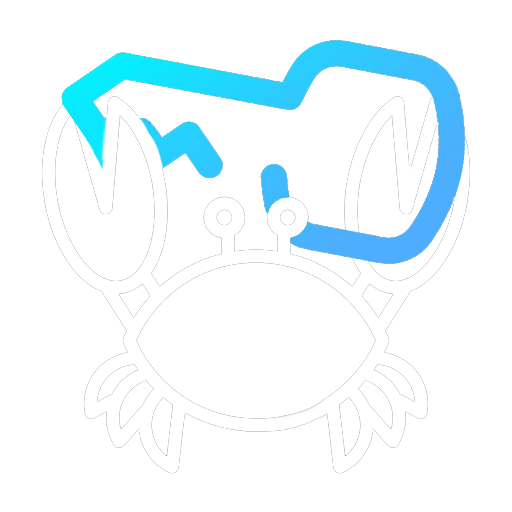

#  KeyKrab (2020)  
 
 
 

## Kişisel Notum

Bitirmeyi en çok istediğim projelerden birisiydi, normalde ücretli olan ama kısa süreliğine ücretsiz dağıtılan oyunları paylaştığım bir projeydi, çok küçük bir kısmını tamamlayıp yarıda bırakmıştım o zamanlar.

---

Bu proje, yazılım yolculuğumun erken döneminde PHP + MySQL ile geliştirdiğim bir uygulamanın korunmuş halidir. Amaç; o dönemin geliştirme yaklaşımını belgelemek, geriye dönük bir arşiv sağlamak ve projeyi güncel ortamlarda sorunsuz çalıştırabilmektir.

> Not: Bu depo legacy statüsündedir. Modern mimari, test altyapısı veya güncel güvenlik standartlarını tam olarak temsil etmez.

## Proje Özeti

- Uygulama türü: Ücretsiz oyun paylaşım platformu
- Geliştirme dönemi: 2020
- Modernizasyon yaklaşımı: Docker Compose ile taşınabilir çalışma ortamı
- Hedef: Legacy kodu bozmadan güncel sistemlerde çalıştırmak

## Teknik Yığın

| Bileşen | Sürüm | Açıklama |
| :--- | :--- | :--- |
| PHP | 7.2-apache | Apache üzerinde PHP 7.2, PDO/MySQLi desteği |
| MySQL | 5.7 | Legacy uyumluluk için tercih edildi |
| Docker | Compose | İzole, tekrarlanabilir geliştirme ortamı |
| Apache Modülleri | mod_rewrite | .htaccess kuralları için aktif |

## Hızlı Başlangıç

Ön koşul: Docker Desktop (veya Docker Engine + Compose) kurulu olmalıdır.

1. Depoyu klonlayın.

    ```bash
    git clone https://github.com/burakurer/keykrab.git
    cd keykrab
    ```

2. Konteynerleri ayağa kaldırın.

    ```bash
    docker-compose up -d --build
    ```

3. Servisleri kontrol edin.

    ```bash
    docker-compose ps
    ```

4. Uygulamayı açın.

    - Web: http://localhost:10019
    - Yönetim Paneli: http://localhost:10019/rootKrab
    - MySQL: `localhost:10020` (TCP bağlantısı, tarayıcı URL'si değildir)
        - Kullanıcı: root
        - Parola: keykrab

## Servisler ve Portlar

| Servis | Port | Amaç |
| :--- | :--- | :--- |
| Web (Apache + PHP) | 10019 | KeyKrab web uygulaması |
| Veritabanı (MySQL) | 10020 | MySQL sunucusu |

## Faydalı Docker Komutları

Çalıştırma:

```bash
docker-compose up -d
```

Durdurma:

```bash
docker-compose down
```

Veri dahil temiz kapatma:

```bash
docker-compose down -v
```

Log görüntüleme:

```bash
docker-compose logs -f
```

## Mimari Notlar

- Proje, framework tabanlı değildir; klasik PHP dosya yapısına sahiptir.
- Uygulama davranışı, dönemsel geliştirme tercihlerini bilinçli olarak korur.
- Konteynerizasyonun temel amacı kodu dönüştürmek değil, çalıştırılabilirliği sürdürmektir.

## Sorun Giderme

- Port çakışması varsa docker-compose.yml içindeki host portlarını değiştirin.
- Eski veritabanı kalıntılarında temiz başlangıç için `docker-compose down -v` komutunu kullanın.
- İlk kurulumda SQL hatası veriyorsa 5-10 saniye kadar bekleyin, yine olmazsa logları kontrol edin ve konteynerleri yeniden başlatın.

## Proje Sahibi

Burak M. ÜRER

## Lisans

[MIT](https://choosealicense.com/licenses/mit/)